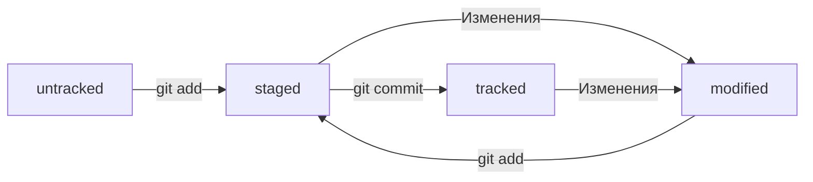

# Шпаргалка с основными командами Git

## Первоначальная настройка
Настройка информации о пользователе для всех локальных репозиториев  
`$ git config --global user.name "[имя]"`  
Устанавливает имя, которое будет отображаться в поле автора у выполняемых вами коммитов  
`$ git config --global user.email "[адрес электронной почты]"`  
Устанавливает адрес электронной почты, который будет отображаться в информации о выполняемых вами коммитах

## Создание репозитория
Создание нового репозитория или получение его по существующему URL-адресу  
`$ git init [название проекта]`  
Создаёт новый локальный репозиторий с заданным именем  
`$ git clone [url-адрес]`  
Скачивает репозиторий вместе со всей его историей изменений

Также можно переместиться в необходимую папку и сделать её Git-репозиторием введя команду:  
`$ git init`

## Операции с файлами
Перемещение и удаление версий файлов репозитория  
`$ git rm [файл]`  
Удаляет конкретный файл из рабочей директории и индексирует его удаление  
`$ git rm --cached [файл]`  
Убирает конкретный файл из контроля версий, но физически оставляет его на своём месте  
`$ git mv [оригинальный файл] [новое имя]`  
Перемещает и переименовывает указанный файл, сразу индексируя его для последующего коммита

## Внесение изменений
Просмотр изменений и создание коммитов (фиксация изменений)  
`$ git status`  
Перечисляет все новые или изменённые файлы, которые нуждаются в фиксации  
`$ git diff`  
Показывает различия по внесённым изменениям в ещё не проиндексированных файлах  
`$ git add [файл]`  
Индексирует указанный файл для последующего коммита  
`$ git diff --staged`  
Показывает различия между проиндексированной и последней зафиксированной версиями файлов  
`$ git reset [файл]`  
Отменяет индексацию указанного файла, при этом сохраняет его содержимое  
`$ git commit -m "[сообщение с описанием]"`  
Фиксирует проиндексированные изменения и сохраняет их в историю версий

## Просмотр истории
Просмотр и изучение истории изменений файлов проекта  
`$ git log`  
История коммитов для текущей ветки  
`$ git log --follow [файл]`  
История изменений конкретного файла, включая его переименование  
`$ git diff [первая ветка]...[вторая ветка]`  
Показывает разницу между содержанием коммитов двух веток  
`$ git show [коммит]`  
Выводит информацию и показывает изменения в выбранном коммите  
  
Вот из каких элементов состоит описание:  
1. Строка из цифр и латинских букв после слова **commit** — это уже знакомый вам хеш коммита.
2. **Author** — имя автора и его электронная почта.
3. **Date** — дата и время создания коммита.
4. Сообщение к коммиту.

Если в репозитории уже много коммитов — например, сотни или тысячи, — пригодится сокращённый лог. С ним можно быстро найти нужный коммит по описанию.  
Сокращённый лог вызывают командой `git log` с флагом `--oneline` (англ. «одной строкой»). При этом в терминале появятся только первые несколько символов хеша каждого коммита и комментарии к ним.

## Синхронизация с удалённым репозиторием
Регистрация удалённого репозитория и обмен изменениями  
`$ git fetch [удалённый репозиторий]`  
Скачивает всю историю из удалённого репозитория  
`$ git merge [удалённый репозиторий]/[ветка]`  
Вносит изменения из ветки удалённого репозитория в текущую ветку локального репозитория  
`$ git push [удалённый репозиторий] [ветка]`  
Загружает все изменения локальной ветки в удалённый репозиторий  
`$ git pull`  
Загружает историю из удалённого репозитория и объединяет её с локальной. pull = fetch + merge
  
## Хеш — идентификатор коммита

В процессе работы с Git вам будет часто встречаться понятие «хеш коммита». Эти странные строчки с бессмысленным (на первый взгляд) набором букв и цифр вы могли видеть, когда вызывали команду `git log` и выводили историю коммитов.  
**Хеширование** (от англ. *hash*, «рубить», «крошить», «мешанина») — это способ преобразовать набор данных и получить их «отпечаток» (англ. *fingerprint*).  
Информация о коммите — это набор данных: когда был сделан коммит, содержимое файлов в репозитории на момент коммита и ссылка на предыдущий, или **родительский** (англ. *parent*), коммит. Git хеширует (преобразует) эту информацию с помощью алгоритма **SHA-1** (от англ. ***S**ecure **H**ash **A**lgorithm* — «безопасный алгоритм хеширования») и получает для каждого коммита свой уникальный хеш — результат хеширования.

## HEAD

Файл HEAD (англ. «голова», «головной») — один из служебных файлов папки .git. Он указывает на коммит, который сделан последним (то есть на самый новый).  
Внутри HEAD — ссылка на служебный файл: refs/heads/master (или refs/heads/main в зависимости от названия ветки). Если заглянуть в этот файл, можно увидеть хеш последнего коммита.  
Когда вы делаете коммит, Git обновляет refs/heads/master — записывает в него хеш последнего коммита. Получается, что HEAD тоже обновляется, так как ссылается на refs/heads/master.

## Статусы untracked/tracked, staged и modified

- **`untracked`** (англ. «неотслеживаемый»)  
Новые файлы в Git-репозитории помечаются как `untracked`, то есть неотслеживаемые. Git «видит», что такой файл существует, но не следит за изменениями в нём. У `untracked`файла нет предыдущих версий, зафиксированных в коммитах или через команду `git add`.  
- **`staged`** (англ. «подготовленный»)  
После выполнения команды `git add` файл попадает в **staging area** (от англ. *stage* — «сцена», «этап [процесса]» и *area* — «область»), то есть в список файлов, которые войдут в коммит. В этот момент файл находится в состоянии `staged`.  
- **`tracked`** (англ. «отслеживаемый»)  
Состояние `tracked` — это противоположность `untracked`. Оно довольно широкое по смыслу: в него попадают файлы, которые уже были зафиксированы с помощью `git commit`, а также файлы, которые были добавлены в staging area командой `git add`. То есть все файлы, в которых Git так или иначе отслеживает изменения.  
- **`modified`** (англ. «изменённый»)  
Состояние `modified` значит, что Git сравнил содержимое файла с последней сохранённой версией и нашёл отличия. Например, файл был закоммичен и после этого изменён.  

## Жизненный цикл файла в Git

## Какие состояния показывает команда git status

- `staged` (`Changes to be committed` в выводе `git status`);
- `modified` (`Changes not staged for commit`);
- `untracked` (`Untracked files`).

# Стили оформления сообщений к коммитам

## Корпоративный

Во многих компаниях применяется Jira — система для организации проектов и задач. У каждой задачи в Jira есть идентификатор из нескольких заглавных латинских букв и номера. Например, `LGS-239` значит, что это 239-я задача в проекте **LGS** (сокращение от англ. ***l**o**g**istic**s*** — «логистика»).  
В корпоративном стиле в начале сообщения обычно указывают Jira-ID, а после — текст сообщения.  
`$ git commit -m "LGS-239: Дополнить список пасхалок новыми числами"`  

## Conventional Commits

Стандарт **Conventional Commits** (англ. «соглашение о коммитах») отличается качественной документацией и подробной проработкой. Он подходит для репозиториев с исходным кодом программ. А вот использовать его для других типов проектов было бы неудобно.  
Conventional Commits предлагает такой формат коммита: `<type>: <сообщение>`. Первая часть `type` — это тип изменений. Таких типов достаточно много. Вот два примера:  
- `feat` (сокращение от англ. *feature*) — для новой функциональности;
- `fix` (от англ. «исправить», «устранить») — для исправленных ошибок.
Например, сообщение может быть таким.  
`git commit -m "feat: добавить подсчёт суммы заказов за неделю"`  

## GitHub-стиль

GitHub можно использовать не только для хранения файлов проекта, но и для ведения списка задач (англ. issue) этого проекта. Если коммит «закрывает» или «решает» какую-то задачу, то в его сообщении удобно указывать ссылку на неё. Для этого в любом месте сообщения нужно указать '#<номер задачи>'. Например, вот так.  
`$ git commit -m "Исправить #334, добавить график температуры"`  
В таком случае GitHub свяжет коммит и задачу.	